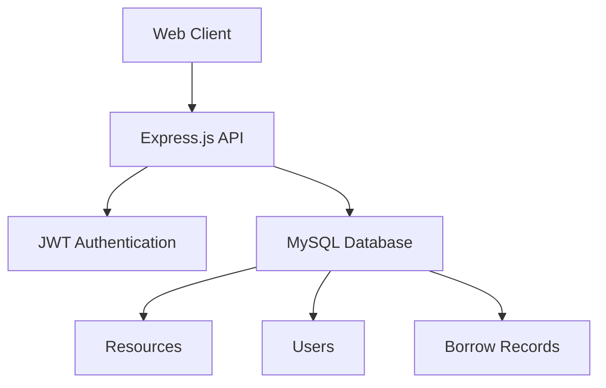

# 📚 Library Management System

  
  


A modern web-based library management system with elegant workflows for librarians and patrons. Built with ❤️ using Node.js and MySQL.


## 🌟 Key Features

### 🧑💻 Librarian Portal
| Feature                | Description                                                                 |
|------------------------|-----------------------------------------------------------------------------|
| 📖 Resource Management | Full CRUD operations for books/journals with inventory tracking            |
| 👥 User Administration | Create/update patron accounts with role-based access control               |
| 📊 Analytics Dashboard | Visualize borrowing patterns and resource availability                     |

### 👨🎓 Patron Portal
| Feature                | Description                                                                 |
|------------------------|-----------------------------------------------------------------------------|
| 🔍 Advanced Search     | Fuzzy search by title/author/ISBN with auto-suggest                        |
| 🕒 Self-Service        | Borrow/renew items (2 renewals max) with due date reminders                |
| 📚 Borrowing History   | Track current/past borrowings with return status                           |

## 🚀 Installation Guide

### Prerequisites
- Node.js 16+
- MySQL 8+
- Git

### Step-by-Step Setup
```bash
# Clone repository
git clone https://github.com/yourusername/library-management-system.git
cd library-management-system

# Install dependencies
cd backend && npm install

# Configure environment
cp .env.example .env
# Edit .env with your credentials

# Initialize database
npm run db:setup

# Start development server
npm run start:dev
```

Access the frontend at `http://localhost:3000`

## 🔧 System Architecture



## 📚 Database Schema

```sql
CREATE TABLE Users (
    user_id INT PRIMARY KEY AUTO_INCREMENT,
    username VARCHAR(50) UNIQUE NOT NULL,
    email VARCHAR(100) UNIQUE NOT NULL,
    password_hash VARCHAR(255) NOT NULL,
    role ENUM('Librarian', 'Patron') NOT NULL
);

CREATE TABLE Resources (
    resource_id INT PRIMARY KEY AUTO_INCREMENT,
    title VARCHAR(255) NOT NULL,
    author VARCHAR(255) NOT NULL,
    isbn VARCHAR(20) UNIQUE,
    available_copies INT DEFAULT 0
);

CREATE TABLE Borrowings (
    borrowing_id INT PRIMARY KEY AUTO_INCREMENT,
    user_id INT REFERENCES Users(user_id),
    resource_id INT REFERENCES Resources(resource_id),
    borrow_date DATE NOT NULL,
    due_date DATE NOT NULL,
    renewals INT DEFAULT 0
);
```

## 📜 API Endpoints

### Authentication
| Method | Endpoint             | Description                   |
|--------|----------------------|-------------------------------|
| POST   | `/api/auth/login`    | User login with JWT return    |
| POST   | `/api/auth/register` | New user registration         |

### Resources
| Method | Endpoint             | Description                   |
|--------|----------------------|-------------------------------|
| GET    | `/api/resources`     | List all resources            |
| POST   | `/api/resources`     | Create new resource           |
| PUT    | `/api/resources/:id` | Update existing resource      |

[View Complete API Documentation](docs/API.md)

## 🤝 Contribution Guidelines

1. Fork the repository
2. Create feature branch:  
   `git checkout -b feature/your-feature`
3. Commit changes:  
   `git commit -m 'Add amazing feature'`
4. Push to branch:  
   `git push origin feature/your-feature`
5. Open a Pull Request

## 📜 License
Distributed under MIT License. See `LICENSE` for details.

---

**Acknowledgments**  
- [Express.js](https://expressjs.com/) Team
- [JWT](https://jwt.io/) Authentication Standard
- Community-driven development inspiration

**Happy Coding!** 🚀
